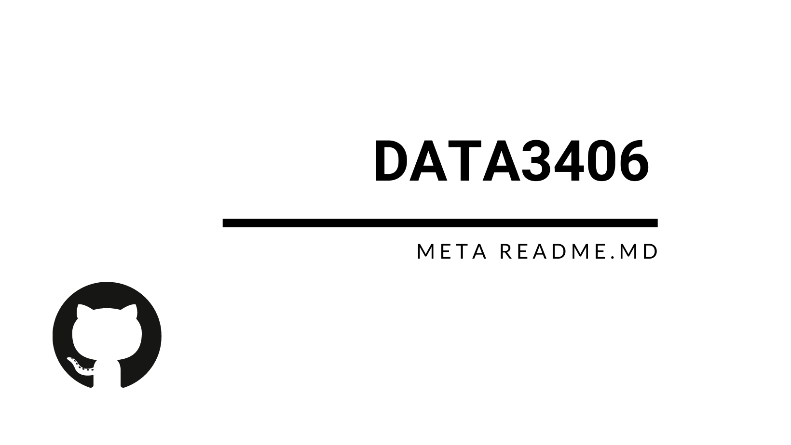

<!--  -->


# META readme.md
Introduction to README.mds - WHY &amp; HOW 💡

This is a guide to writing README.md files for collaborative Data Science/Data mining/Analytics projects, hosted on GitHub. We also discuss some other aspects of organising your projects with GitHub repositories. This is less of guide on writing README.md for open source software development. There are other great sources about this, linked below. This README starts with the WHY section and is followed by the HOW. 

> GitHub: **Initialize with a README?**  
> You after reading this: **ALWAYS!**

These badges contain up-to-date meta information about repositories on mainstream (non-enterprise) GitHub:  


<!-- badges should work once this is non-Enterprise GitHub  -->

You can add badges to indicate for example the time of the last commit, the number of contributors, or the version.  
For more details see [Shields on GitHub](https://github.com/badges/shields)

## WHY

#### For **collaboration** 👪

A README file is the place to collect all **metadata of your project**. As many aspects of the project, like variable meaning, data origin, or ethics guidelines are not self-explanatory and always have implicit knowledge tied to them, a README helps to make that knowledge explicit. For efficient **group work**, especially in multi-disciplinary or asynchronous projects it is like the **common ground of group knowledge** needed to make sense of the project. While writing the README always ask yourself: 

> *If a new collaborator will join the project now and no current team member is available to answer questions, what should the repository contain for that person to be able to start working?*. 

Depending on the context of your project, some prior knowledge may be assumed, but clearly state this and do not forget about other **stakeholders** that might read the README (Reviewers for Nature, your parsimonious tutor, your favourite professors, highly selective grant committees, your dream employer...)

#### For **reproducibility** ♻️

If the same research questions was to be given to another research group alongside the same raw data, would they come to the same conclusion? If not, why is this the case? A README.md will help to express which methodological choices and which design choices you made during your analysis that led to your conclusion. It will also state underlying **assumptions** that might be more subjective than objective. Relevant to this question, this article might be an interesting read:

> [Silberzahn, Raphael, et al. "Many analysts, one data set: Making transparent how variations in analytic choices affect results." Advances in Methods and Practices in Psychological Science 1.3 (2018): 337-356.](https://journals.sagepub.com/doi/pdf/10.1177/2515245917747646)

#### For **documentation** 📓

Often your **future self** a year from now will not remember all the details from your past project. Think long-term, do yourself a favour and write a good README, not just for others but for yourself. It will make life much easier when you continue on a larger project once you find that time again. GitHub for many of us will be like a **portfolio** for architects. A well-written README is the gateway for people to look deeper into what you do. A project with a non-existent or poorly structured README is like a restaurant with only 1-star reviews. Put in some work and get the reward!

## HOW - Table of contents

* [Checklist](#checklist)
* [Other README guides](#-other-readme-guides)
* [Examples/Best Practice README.md's](#examples)
* [Template](#template)
* [Invitation to contribute](#contribute)

Checklist
---------


- [x] **Access**  
If you are working on GitHub enterprise, make sure to add collaborators to the project, especially if it is private. This will prevent lost access in the case of the main project owner leaving the organisation.
- [ ] **Ethics**  
If your project needed Ethics approval, mention the approval and the conditions that are particularly relevant to the repository. This can for example include the people that have access (I hope your repository is set to private, otherwise you are in trouble), the hosting location, anonymisation or others.
- [ ] **Data origin**
Clarify where the data comes from and what license the use is under. Is the data from an open source project? Who collected it? 
- [ ] **Time stamps**  
Although GitHub has time stamps, it can be useful to include dates. For example say *'as of 20/10/2020 these papers were published in relation to the project'*. This is important information for when a README is updated, because a date supplies a starting point for additions.
- [ ] **Project owners**  
Include contact information for at least two people that are in charge of the project and repository. Include the the organisation (University, Faculty, School) and an email address. For groups, include the roles (manager, tracker...) and details of all team members
- [ ] **Folder naming**  
Trade-off between compactness and descriptiveness. Stick to a naming structure.
- [ ] **Folder structure**  
The structure of your GitHub project (aka repository) is important to keeping things neat. In general I would say that less is more and that it is preferable to have a flat folder hierarchy. A folder to only hold one file is often unnecessary. I recommend the following structure:

* **data_raw** (our favorite oxymoron. Keep your original files separate from the rest)
* **data_engineered** (files of data that are a result of your cleaning/modelling/analysis belong here)
* **code_python** (for all your python scripts)
* **code_r** (for all your R scripts, you may want to separate **practice code** and **product code**)
* **vis** (for visualizations if need)
* **README.md**

Furthermore I suggest that all code scripts contain a standardised header to tie in with the project.

* INPUT: (typically a file or more from data_raw)
* OUTPUT: (The output will often be a file for data_engineered, a visualization or a model)
* DRIVING QUESTION/PURPOSE: (Describe the driving question or function behind the code. This may be EDA, or a questions like 'Do men eat less vegetable serves than women eat'?)

- [ ] **Variable naming**  
Similar to folder naming: Trade-off between compactness and descriptiveness. Variable names like **TOTAL** are ambiguous and should be avoided. **Total.energy.intake.incl.fiber.kJ** might be better. If you want to keep them short you may use **Total.energy.intake.kJ** and explain in the README that all energy includes dietary fiber. 
- [ ] **Variable description**  
Most variable names are not as descriptive and unambiguous as they might seem to the person collecting the data. For example, a column called *TOTAL* in a larger data set could totally be everything and nothing. Units are another big one, especially in our globalised world. Is it energy in kJ or or kcal? If you are adhere to a particular standard, that makes things easier but please link the source, so that you speak a common language in multi-disciplinary projects.
- [ ] **README Structure**  
Structure eats content for breakfast. Or was it culture and strategy? It is also good practice to stick to one structure within a project. A Table of Contents is a good idea for longer README's. See the template below for a proposed README structure.
- [ ] **IDs**  
To reiterate, ID stands for IDentifier (or Identity Document) and should uniquely identity a person, a subject, an object. Outline what the ID of each data set is. In addition, it can be essential to illustrate the expected behaviour for data integration purposes. For example, state that you expect that set of ID's in one dataset is a subset of another dataset. This is important information for merging/joins. Based on my experience, I recommend to run some simple checks once you get started on a new dataset. 
- [ ] **Driving Question**  
All projects should have a driving question behind it. It is good to explicitly state it to not lose track of the goal. Whether it is a well-defined research question or 'building a data corpus for future Educational Data Mining tasks working towards an Open Learner Model', the driver of the projects should be part of your repository.
- [ ] **Related publications and external sources**
List publications (citations) with links to make it easy for viewers to understand the academic context.
- [ ] **GitHub Issues**  
As with every other bit of code in your repository, you can create an issue, assign the person responsible for the issue, and commit the fix. Do this for changes that need to be made for README files as well to keep track of updates to accompany changes in other parts of the repository.
- [ ] **README hierarchy**  
When a lot of additional information is needed, you might  want to use README.md files at different level of the project. If the varibles in the rawdata all need information, but an additional README.md on that level in your folder structure right next to all raw data files. You should mention this and potentially link it in yoiu main README.md that resides on the highest level of your GitHub repository. Adapt the naming of the file so it fits you structure (eg. README_rawdata.md)


### Other README guides
-------------

* [Official GitHub markdown cheatsheet about Formatting, integration into GitHub and more](https://guides.github.com/pdfs/markdown-cheatsheet-online.pdf)  
The rendering of GitHub is slightly different to others, therefore this is a good source for GitHub readme.md's
* [Official GitHub guide about README's and Wikis](https://guides.github.com/features/wikis/)
* [Cornell 'guide to writing "readme" style metadata' + template](https://data.research.cornell.edu/content/readme)
* [KDnugget GitHub Readme analyzer](https://www.kdnuggets.com/2016/05/algorithmia-data-science-approach-good-github-readme.html)


Examples/Best Practice README.md's
-------------

* [Example of extensive README.md by 'Hackthon Starter'](https://github.com/sahat/hackathon-starter/)  
I recommend looking into the [raw version of their README.md](https://raw.githubusercontent.com/sahat/hackathon-starter/master/README.md)


Template
-------------

Here is an example `README.md` file with code you can copy and past into your project.

```md
# Project title

Short description about the project.

## Driving question

Outline the driving question behind the project.

## Table of contents

1. Section 1
2. Section 2
3. Section 3

## Background

### Data origin

### Data definitions

Summary of files, tables, and fields. You can use markdown `tables` here to improve the formating of the information.

### Ethics

## Getting started

Short list of intructions for new collaborators to get up and running with the project.

Example list of commands:

- `$ git clone git@github.com/username/project.git`
- `$ cd ./project`
- `$ pip install`
- `$ jupyter lab .`

## Contributing

Intructions on how to contribute to the project. Consider having a `CONTRIBUTING.md` file in the repository.

## Project owner(s) & contact details

Contact details of the people who created and/or are maintaing the project.

## License

Include licensing information. Consider having a `LICENSE.md` file in the repository.

```

Here are links to other **external example templates**:

* [Awesome README template by Navendu Pottekkat](https://github.com/navendu-pottekkat/awesome-readme/blob/master/README.md)

Invitation to contribute
------------------------

Dear Reader, as we are only at the beginning of building up this guide, we would highly appreciate contributors to add to this README guide. Pull requests are very welcome! Or reach out to kben0192@uni.sydney.edu.au 

Thanks!

<!--  -->

